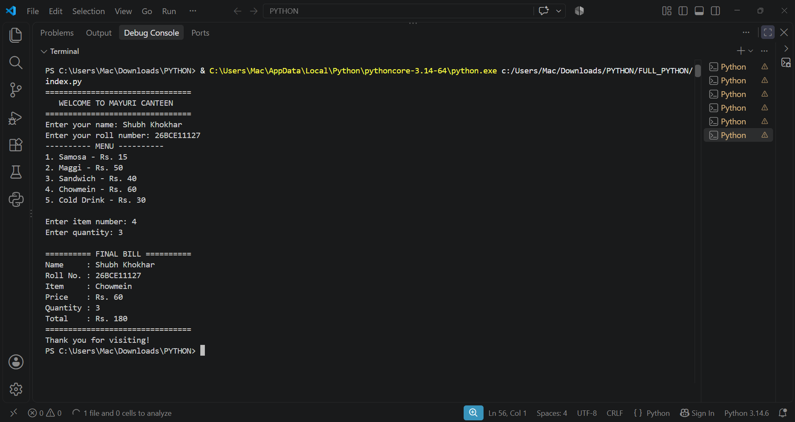

# College Canteen Management System

## Overview
This project is a simple Python-based college canteen management system.
It allows students to view the menu, select a food item, enter quantity,
and calculate the total bill.

## Features
- Display food menu
- Enter student name and roll number
- Select food item
- Enter quantity
- Calculate total bill
- Display final bill

## Technology Used
- Python

## How to Run
1. Download or clone the repository.
2. Open the project folder in terminal.
3. Run:
   python Canteen.py

## Testing
The program was tested by entering different food items and quantities
and checking whether the total bill was calculated correctly.

## Screenshots

